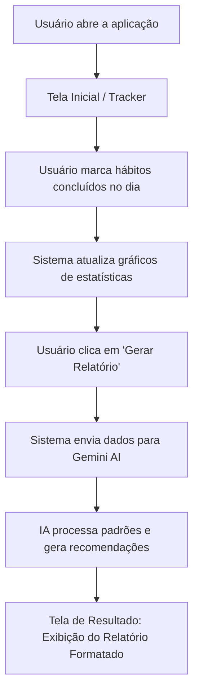

# PRD - HabitTracker AI

## 1. Visão do Produto
O **HabitTracker AI** é um assistente pessoal de alta performance que transforma o rastreamento de hábitos em inteligência acionável. Diferente de trackers comuns, ele utiliza IA Generativa para diagnosticar falhas comportamentais e sugerir ajustes precisos na rotina do usuário.

## 2. Problema
Muitas pessoas tentam implementar novos hábitos (como exercícios, leitura ou dieta), mas falham por **falta de clareza sobre seus próprios padrões de comportamento**. Elas não conseguem identificar quais dias são críticos ou como a falha em um hábito (ex: acordar tarde) gera um efeito dominó em outros (ex: não correr).

## 3. Público-alvo
- Estudantes e profissionais que buscam alta performance.
- Pessoas em transição de estilo de vida que precisam de acompanhamento analítico.
- Entusiastas de produtividade que já utilizam métodos como o "Atomic Habits".

## 4. Proposta de Valor
Entregar não apenas um "check-list", mas um **diagnóstico semanal automatizado** que atua como um coach de comportamento, reduzindo a carga cognitiva de ter que analisar os próprios erros.

## 5. Funcionalidades Principais
- **Tracker Diário Intuitivo:** Interface minimalista para marcação de 6 hábitos fundamentais.
- **Dashboard de Visualização:** Gráficos de barras e indicadores de porcentagem para feedback visual imediato.
- **Relatório de IA Generativa:** Geração de análise profunda utilizando o modelo Gemini, com seções de "Gargalos", "Insights" e "Plano de Ação".
- **Análise de Consistência:** Cálculo automático de adesão semanal.

## 6. Fluxo da Aplicação (Mermaid)

## 7. Descrição das Telas Principais
1. **Tela de Tracker (Principal/Entrada):** Contém a grade de hábitos (linhas) e dias (colunas), além dos cards de estatísticas rápidas.
2. **Tela de Relatório (Resultado):** Exibe o texto gerado pela IA com formatação rica (Markdown), tabelas de adesão e botões de ação para a próxima semana.
3. **Modais de Feedback:** Diálogos de confirmação para reset de dados e carregamento (loading) da IA.

## 8. Critérios de Sucesso do MVP
- O usuário deve conseguir marcar todos os hábitos da semana em menos de 30 segundos.
- O relatório de IA deve ser gerado em menos de 10 segundos.
- As recomendações da IA devem ser específicas (citando dias e hábitos reais do usuário).
